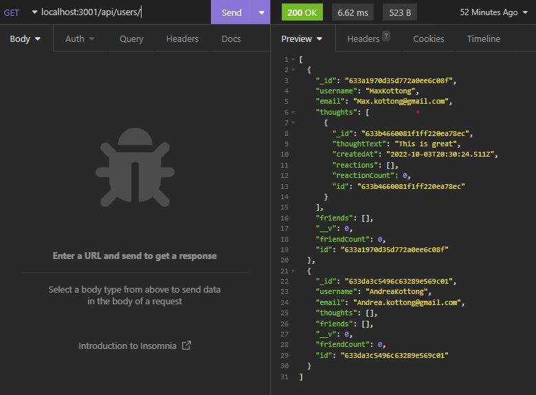

# Social Network API

## Purpose
Show the ability to use the MERN stack by creating a backend and API only portion of a social media app.

## Built With
* MongoDB
* Mongoose
* Express
* Dayjs

## Getting Started
* Install MongoDB Community Server - [Here](https://www.mongodb.com/try/download/community)
* Clone the repo
* Install dependencies with `npm i`
* Use `npm start` to initiate server start sequence

## API Routes
### Users
- GET /api/users - Gets all users
- POST /api/users - Create User
- GET /api/users/:userId - Get user by id
- PUT /api/users/:userId - Update user by id
- DELETE /api/users/:userId - Delete user by id

### Friends
- PUT /api/users/:userId/friends/:friendId - Add friend to userId
- DELETE /api/users/:userId/friends/:friendId - Delete friend from userId

### Thoughts
- GET /api/thoughts - Get all Thoughts
- POST /api/thoughts - Create thought and associate to User
- PUT /api/thoughts/:thoughtId - Update thought by id
- DELETE /api/thoughts/:thoughtId - Delete thought by id

### Reactions
- POST /api/thoughts/:thoughtId/reactions - Create reaction to thought by id
- DELETE /api/thoughts/:thoughtId/reactions/:reactionId - Delete reaction 

## Links
[Demo](https://youtu.be/f0Zc7X-rtgc)